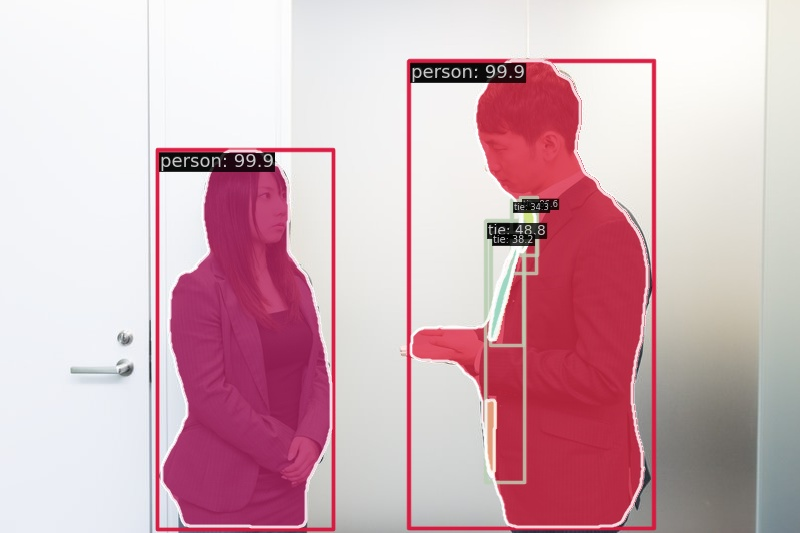

# mmdetection_instance_seg_example
mmdetectionの環境構築と、instance segmentationのサンプル

| 入力画像 | 出力画像 |
| :---: | :---: |
|  | |

## 対象環境
- OS: Windows 10 Pro
- CPU: Core i9-9900K
- RAM: 64GB
- GPU: RTX2080Ti
	- CUDA 11.3


## 環境構築手順
```bash
# ライブラリのインストール
pip install torch==1.12.1+cu113 torchvision==0.13.1+cu113 torchaudio==0.12.1 --extra-index-url https://download.pytorch.org/whl/cu113
pip install -U openmim opencv-python Pillow matplotlib

# mmcvのインストール
git clone https://github.com/open-mmlab/mmcv.git
cd mmcv
pip install -r requirements.txt
mim install -e .

cd ../

# mmdetectionのインストール
git clone https://github.com/open-mmlab/mmdetection.git
cd mmdetection
pip install -e .
```

## サンプル実行方法
```bash
# チェックポイントダウンロード
mim download mmdet --config mask-rcnn_r50-caffe_fpn_ms-poly-3x_coco --dest ./checkpoints

python test_mmdet.py pic/sample.jpg --config mmdetection/configs/mask_rcnn/mask-rcnn_r50-caffe_fpn_ms-poly-3x_coco.py --checkpoint ./checkpoints/mask_rcnn_r50_caffe_fpn_mstrain-poly_3x_coco_bbox_mAP-0.408__segm_mAP-0.37_20200504_163245-42aa3d00.pth 
```

## Author
[T-Sumida](https://twitter.com/sumita_v09)

## License
画像は[フリー素材ぱくたそ](https://www.pakutaso.com/)様の「[スタンディング会議中の上司と部下](https://www.pakutaso.com/20140921261post-4590.html)」を利用しています。